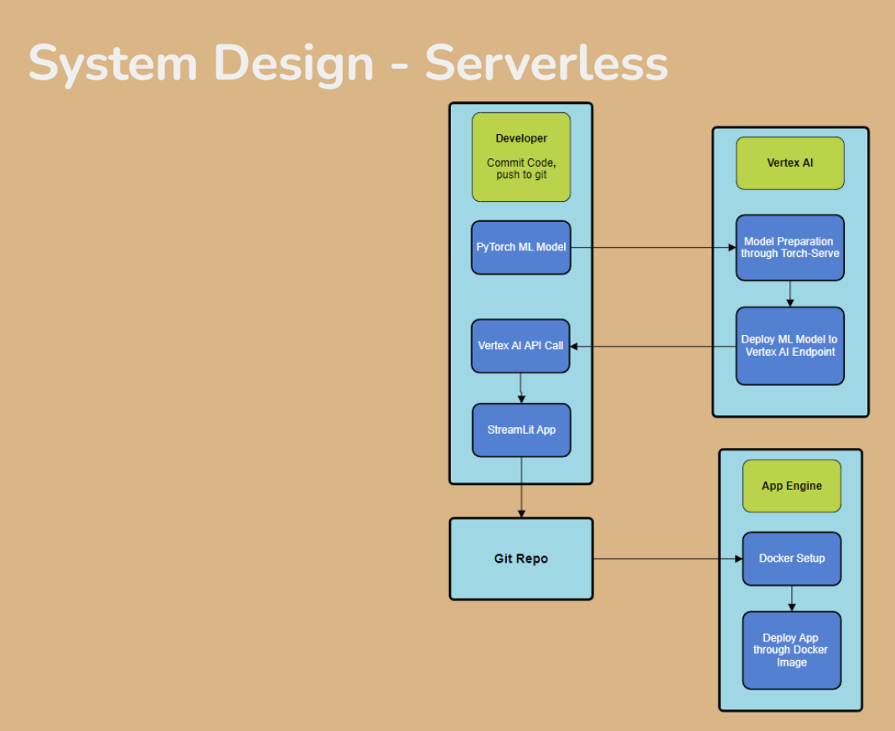
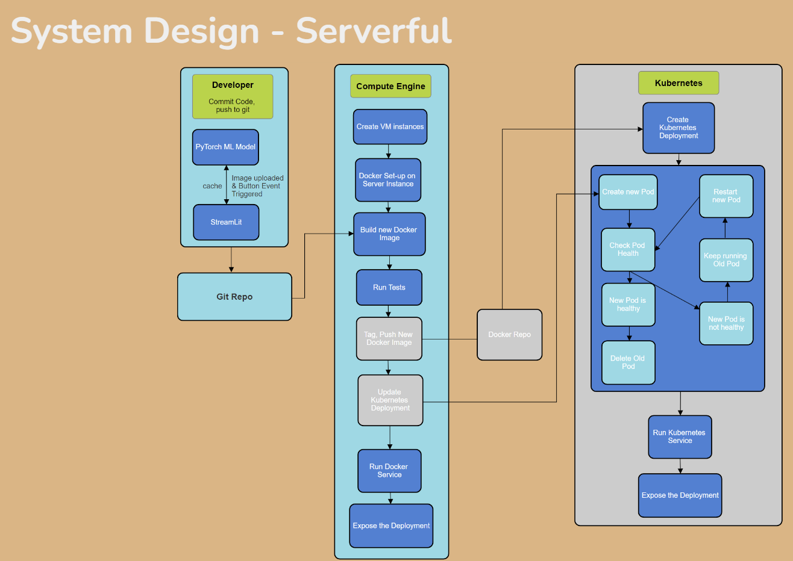

# CMPT756 Project: Containerized or Serverless Learning

**Authors:** Gouttham Nambirajan, Zareef Raiyan Safdar, Midhun Jisha Manoj, Ashwin Abraham John, Wenhe Wang

## Solution Design

We are conducting a project to compare serverless and serverful (containerized) deployments of a PyTorch-based fall detection model using the Google Cloud Platform (GCP). Here's an overview of our approach:

### Serverless Approach

### Serverful Approach

## Evaluation Plan

1. **Use Postman API** to send POST requests to serverful and serverless ML apps.
2. **Measure response time** to evaluate latency differences.
3. **Potential extra experiment:** Compare performance using GPU-based Vertex AI vs GPU VM instance with Google Kubernetes Engine.

# CMPT 756: Distributed & Cloud Systems

**Instructor:** Ouldooz Baghban Karimi @ SFU, Spring 2024

**Teaching Assistants:**
- Owais Ahmed Hetavkar
- Darshaun Kandasamy Govindhraj
- Pranjal Verma

## Course Schedule

