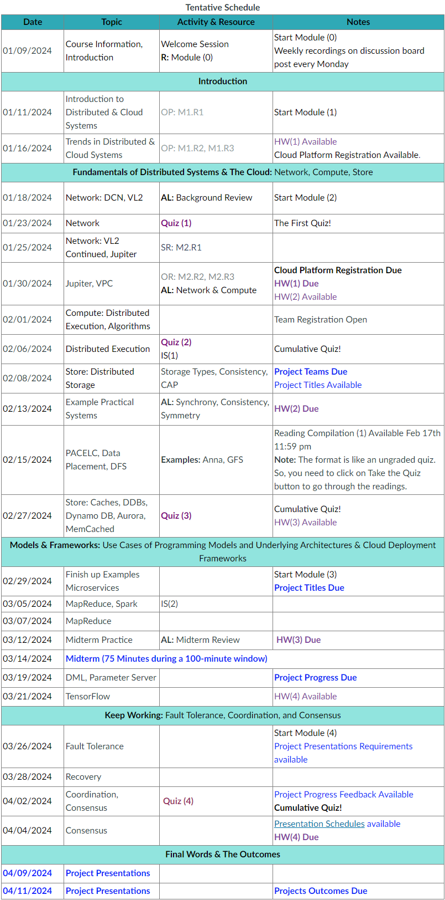

# CMPT756 Project: Containerized or Serverless Learning

**Authors:** Gouttham Nambirajan, Zareef Raiyan Safdar, Midhun Jisha Manoj, Ashwin Abraham John, Wenhe Wang

## Solution Design

We are conducting a project to compare serverless and serverful (containerized) deployments of a PyTorch-based fall detection model using the Google Cloud Platform (GCP). Here's an overview of our approach:

### Serverless Approach

- **Acquire a pre-trained PyTorch model** for pose estimation to get fall detection.
- **Convert the model** to a GCP-compatible format using torch-serve.
- **Upload the model** to Google Cloud Storage and set up the Vertex AI model endpoint.
- **Develop a StreamLit-based Python App** to send API calls to the Vertex AI model endpoint.
- **Deploy the StreamLit app** to Google App Engine and send prediction requests through it.

### Serverful Approach

It is similar to serverless; however, it requires some changes:

- **Modify the StreamLit-based Python App** to run the PyTorch Model directly.
- **Set up Docker** on a VM instance using Google Compute Engine.
- **Build a Docker image** containing the StreamLit app and PyTorch model.
- **Create a Kubernetes deployment** to manage the cluster and host the backend app.

## Evaluation Plan

1. **Use Postman API** to send POST requests to serverful and serverless ML apps.
2. **Measure response time** to evaluate latency differences.
3. **Potential extra experiment:** Compare performance using GPU-based Vertex AI vs GPU VM instance with Google Kubernetes Engine.

# CMPT 756: Distributed & Cloud Systems

**Instructor:** Ouldooz Baghban Karimi @ SFU, Spring 2024

**Teaching Assistants:**
- Owais Ahmed Hetavkar
- Darshaun Kandasamy Govindhraj
- Pranjal Verma

## Course Schedule

